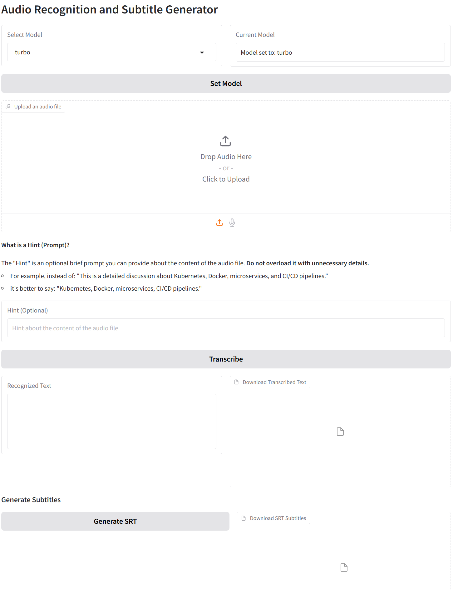

# Audio Transcription App

A user-friendly audio transcription web application built using **Gradio** and **OpenAI's Whisper** model. This app allows users to upload audio files, transcribe them to text, and even save the output for later use.

> **Note:** This project is being refactored into a modular architecture.
> You can now run it entirely locally or connect to a remote Whisper API service for transcription, allowing for flexible deployment across multiple machines.
> In future updates, the server-side components will include FastAPI + Uvicorn support for robust, production-grade hosting (including Docker deployments).
---

## Features
- **Model Selection**: Choose from a variety of Whisper models based on your performance and accuracy needs.
- **Hint Support**: Optionally provide context for better transcription accuracy.
- **Audio Upload**: Supports audio files in various formats.
- **Automatic Formatting**: Converts audio to the WAV format (16kHz, mono) for compatibility with the Whisper model.
- **Accurate Transcription**: Uses OpenAI's **Whisper** model for speech-to-text transcription.
- **Subtitle Generation**: Create SRT subtitle files directly from the transcription.
- **Translate Feature**: "Translate" button for translating transcriptions. Available for specific models (`medium`, `large`, `small`, and `base`) and hidden for unsupported models (`tiny` and `turbo`).
- **Downloadable Results**: Save your transcription and subtitles with a single click.
- **Intuitive Web UI**: Built using **Gradio** for a smooth and interactive user interface.
- **Direct Programmatic Usage**: Use `audio_print.py` as a standalone utility to transcribe audio files without the GUI.
- **Formatted Dialogue Output**: Automatically formats raw transcripts into clean, readable dialogue scripts using a local LLM (`gemma3:12b` via Ollama).
- **Speaker Labelling**: Adds speaker names and corrects punctuation for better readability.
- **Narration Styling**: Italicises non-verbal and narrated content (e.g., *[laughter]*, *Narrator: You now have 30 seconds...*).
- **Local LLM Integration**: Uses Ollama with `gemma3:12b`, no internet or external API needed.
- **Downloadable Formatted Text**: Easily save the result as a formatted `.txt` file ready for editing, publishing or scripting.
- **Modular Architecture**: Easily switch between local processing and remote API mode for distributed and scalable deployment.
- **Production-Ready API (Coming Soon)**: The server component will feature FastAPI + Uvicorn, enabling secure and scalable deployments on dedicated servers or in Docker containers.
---



---
## Requirements

To use the app, ensure the following are installed on your system:
- **Python 3.10+**
- **`ffmpeg`** (cross-platform multimedia framework, required for audio processing)
- Python packages:
  - **openai-whisper**
  - **gradio**
  - **ollama**
  - **ffmpeg-python** (optional, if used)
  - **torch** (PyTorch) — Make sure to install the version compatible with your CUDA version. 
    You can check the [official PyTorch compatibility table](https://pytorch.org/) to find the correct version.
    Example:
    ```bash
     pip install torch torchvision torchaudio --index-url https://download.pytorch.org/whl/cu121  
     ```
---

---
## Installation

### 1. Clone the Repository
Clone this repository to your local system:
```bash
git clone https://github.com/loglux/FlexAudioPrint.git
cd FlexAudioPrint
```

### 2. Install Python Dependencies
Install the required Python packages using the `requirements.txt` file:
```bash
pip install -r requirements.txt
```
### 3. Ensure `ffmpeg` is Installed
- For Windows, download `ffmpeg` from [FFmpeg.org](https://ffmpeg.org/download.html) and add it to your system's PATH.
- For Linux/MacOS, install via your package manager:
  ```bash
  sudo apt install ffmpeg   # For Debian/Ubuntu
  brew install ffmpeg       # For Mac using Homebrew
  ```
### 4. Installing PyTorch with CUDA Support

To enable GPU acceleration for Whisper, you need to install a PyTorch version that supports your CUDA version. Use the following command, replacing `cu118` with your specific CUDA version:
```bash
pip install torch torchvision torchaudio --index-url https://download.pytorch.org/whl/cu118
```
---

## Whisper Model

By default, FlexAudioPrint uses the **large** model of OpenAI's Whisper for transcription, as it provides the highest accuracy for most use cases. However, the model can be replaced with other available Whisper models depending on your resource constraints or accuracy needs. The choice of model can significantly impact both performance and accuracy.

### Available Whisper Models

| Model Name        | Parameters | English-only Model | Multilingual Model | Required VRAM | Relative Speed |
|-------------------|------------|--------------------|--------------------|---------------|----------------|
| `tiny`            | 39M        | `tiny.en`          | `tiny`             | ~1 GB         | ~10x           |
| `base`            | 74M        | `base.en`          | `base`             | ~1 GB         | ~7x            |
| `small`           | 244M       | `small.en`         | `small`            | ~2 GB         | ~4x            |
| `medium`          | 769M       | `medium.en`        | `medium`           | ~5 GB         | ~2x            |
| `large` (default) | 1550M      | N/A                | `large`            | ~10 GB        | ~1x            |
| `turbo` | 809M       | N/A                | `turbo`            | ~6 GB         | ~8x            |

### Notes on Model Selection
- Models like `tiny`, `base`, and `small` can run efficiently on a CPU, making them suitable for systems without a GPU.
- While the `turbo` model is faster and more resource-efficient, it has a noticeable drawback: it tends to "swallow" small or less distinct words during transcription. This issue is specific to `turbo` and does not occur with other models like `base`, `small`, or `medium`. Even these smaller models often provide more reliable results, making them preferable over `turbo` when accuracy matters. Personally, I prefer the `large` model over `turbo` due to its superior accuracy, despite its higher resource requirements.
> **Note:** Larger models require more computational resources (RAM, GPU, etc.). Make sure your system meets the requirements for the selected model.

### Default Model on Page Refresh

When the Gradio interface is refreshed, the default model (`turbo`) is reloaded automatically, ensuring consistency across sessions. Users can select other models from the dropdown menu during their session, but these changes will not persist after a refresh.

---

## Usage

### Use with GUI (Gradio)
1. Run the Gradio app:
   ```bash
   python app.py
   ```

2. Open the URL provided by Gradio (e.g., `http://127.0.0.1:7860/`) in your browser and interact with the web interface.

#### Translate Button Visibility

The "Translate" button is dynamically shown or hidden depending on the selected model:
- **Visible** for: `base`, `small`, `medium`, `large`
- **Hidden** for: `tiny`, `turbo`

---

### Use `audio_print.py` Without the GUI
To run the transcription process directly from the command line or using Python scripts, you can use `audio_print.py`.

#### Example Command Line Usage
If you have an audio file and want to transcribe its contents without the GUI:
```bash
python audio_print.py
```

Modify the paths in `audio_print.py` (`input_audio` and `output_text_file`) with the file names of your choice for the audio file you'd like to transcribe and the output file to save the transcription.

---

## How It Works

### 1. **Audio File Upload**
Users can upload an audio file in the Gradio UI. Supported formats include `.wav`, `.mp3`, `.aac`, and others.

### 2. **Audio Conversion**
The app converts the uploaded audio to a `.wav` file with a 16kHz sampling rate and mono channel for compatibility with **Whisper**.

### 3. **Transcription and Subtitle Generation**
The `AudioTranscriber` class uses **Whisper**'s speech-to-text model to transcribe the audio into text and generates subtitles in SRT format

### 4. **Output**
The transcribed text is displayed in the Gradio interface, and the user can save it as a file to download.

---

## Example Usage with Code
If you want to test the transcription programmatically, you can use `audio_print.py`:

```python
from core.audio_print import AudioTranscriber

# Path to your audio file
input_audio = "example_audio.mp3"

# Path for saving the text transcription
output_text_file = "transcription.txt"

# Create an instance of the AudioTranscriber class
audio_transcriber = AudioTranscriber(model_name="base")

# Process the audio file and save the transcription
result = audio_transcriber.process_audio(input_audio, output_text_path=output_text_file)

print("Recognized Text:", result)
```
---
## Flexible Deployment: Local or Remote API Mode

FlexAudioPrint can run in two different modes, controlled by a single environment variable:

- **Local Mode**: All audio transcription and formatting are performed on the same machine. Ideal for desktop or workstation use.
- **Remote API Mode**: The app sends audio files to a remote Whisper API service (launched with FastAPI) for transcription. This allows you to run the heavy model on a powerful PC or server, and interact with the app from another machine (e.g., NAS, thin client, Docker container).

Switch between these modes by editing the `.env` file:

```env
USE_REMOTE_API=true           # Enable remote API mode (set to "false" for local mode)
REMOTE_API_HOST=192.168.1.100 # IP address of the machine running the Whisper API service
REMOTE_API_PORT=9911          # Port for the Whisper API service

OLLAMA_MODEL=gemma3:12b
OLLAMA_BASE_URL=http://192.168.1.100:11434/
```

Copy `.env.example` to `.env` and edit as needed:

```bash
cp .env.example .env
```

**To run the Whisper API service (on your powerful machine with GPU):**
```bash
uvicorn whisper_api.api:app --host 0.0.0.0 --port 9911
```

**To run the client app (on NAS or another computer):**
```bash
python app.py
```
The app will automatically use the remote API if `USE_REMOTE_API=true` is set in `.env`.


---

## License

This project is licensed under the [MIT License](LICENSE). You are free to use, modify, and distribute this project according to the terms of the license.

---

## Contributing

Contributions are welcome! Feel free to open an issue or submit a pull request for any improvements or bug fixes.

---

## Acknowledgments

- **Gradio**: For building an effortless web UI for machine learning models.
- **OpenAI Whisper**: For the incredible whisper-based speech-to-text transcription model.
- **FFmpeg**: For reliable audio processing and conversion.

